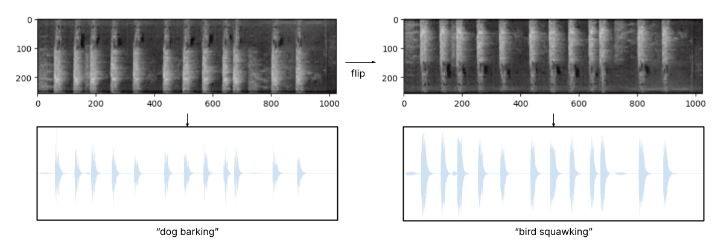

# Generating Audio Illusions with Diffusion Models

Aileen Mi, Manisha Pillai, Valli Nachiappan

Audio Samples for this project can be found here: [[Website](https://beepo34.github.io/audio_illusions/)]

## Colab Demo

Code and example samples can be found in the Google Colab demo below. The demo may be run with the free Colab tier.

## Evaluation

Sample audio files and plots, as well as evaluation metrics/plots can be found in the linked [folder](https://drive.google.com/drive/folders/1x3fxktwavfNckBuAcOLoHJFJt9Mb-FsS?usp=sharing)
